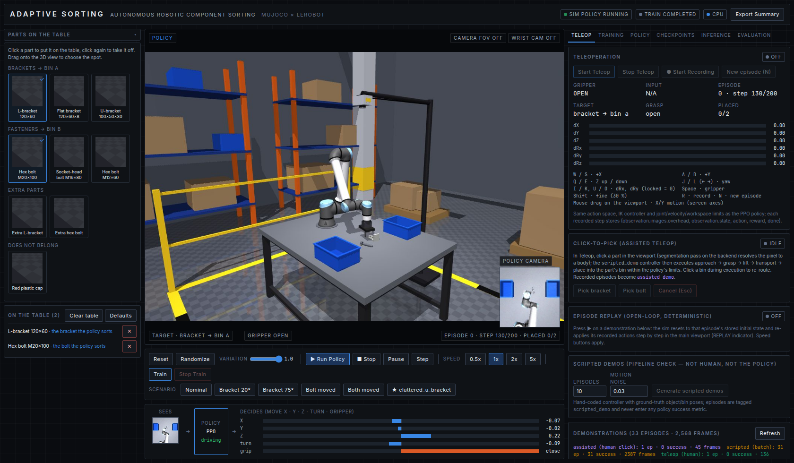

# Adaptive Sorting — Adaptive Vision-Guided Robotic Component Sorting

A local, browser-based robotics simulation: a **Universal Robots UR10e** on a worktable in an industrial
warehouse scene learns — with **real reinforcement learning (PPO)** — to pick an automotive **bracket** and a
**bolt** from randomized positions/orientations and sort them into two blue bins, observed through a real
overhead MuJoCo camera. The browser shows the live simulation, the live policy loop, live training telemetry
and evaluation results. Nothing displayed is faked: every number comes from the running system or reads `N/A`.

**Sorting mapping (fixed):** `bracket → Bin A` (left, +y), `bolt → Bin B` (right, −y).

```
CAMERA (overhead, 64×64 RGB) + ROBOT STATE ─▶ POLICY (PPO: CNN + MLP) ─▶ ACTION (ΔX ΔY ΔZ ΔRx ΔRy ΔRz, gripper)
        ▲                                                                             │
        └──────────────── MuJoCo physics (UR10e + parallel-jaw gripper, contacts) ◀───┘ (IK controller)
```

---

> **Repository contents.** Source (`backend/`, `frontend/`, `simulation/`, `training/`, `lerobot_adapter/`, `configs/`,
> `scripts/`, `tests/`), the UR10e meshes (`simulation/assets/`, BSD-3 from MuJoCo Menagerie), the two shipped
> checkpoints (`checkpoints/checkpoint_000400032` = best by evaluation, `_000402432` = final), the 31 scripted
> demonstration episodes (`datasets/demos/`), evaluation result JSONs and training telemetry (`logs/`), and the
> engineering journals (`PROGRESS.md`, `DEBUGGING.md`, `ASSUMPTIONS.md`). Not included: the Python venv, `node_modules`,
> training-run archives (~2 GB), evaluation rollout datasets (~2.8 GB), frame dumps. Install with `uv pip install -r
> requirements.txt` (or `pip`) and `npm ci` in `frontend/`; see §1.



## 0. Current status (hand-over snapshot, 2026-09-26 — session 3, executive-demo build)

| item | value |
|---|---|
| robot | UR10e (official MuJoCo Menagerie model) |
| active policy | `ppo_bc_anchored_400k` / `checkpoint_000400032` (★ best by eval): BC init from 31 scripted demos → anchored PPO 400 k steps |
| clean evaluation (Evaluation tab, 40 ep, rand 1.0, seed 4242, after Update 7 physics fix) | success 80 %, grasp 100 %, ≥1 placed 93 %, 0 unstable episodes |
| clutter scenario (`clutter_showcase`, 24 ep) | success 67 %, grasp 100 %, 0 unstable, 0 false picks — policy never trained with clutter (DEBUGGING.md part 3) |
| generalization scorecard (5 ep/scenario) | nominal 100 % · bracket 20° 80 % · bracket 75° 80 % · bolt moved 60 % · both moved 80 % |
| difficulty sweep (6 ep/level, levels 0→1) | 0 % · 33 % · 67 % · 33 % · 50 % success (real, non-monotonic) |
| before/after (10 ep, identical seeds) | pre-fix bootstrap 0 % → current 50 % success; 0.3 → 6.3 parts/min; 0 collisions both |
| new in session 3 | replay + click-to-pick (Teleop), scorecard/sweep/failure reel/compare (Evaluation), parts catalog & scene builder (Scene), command panel (Tier 1 rules; Tier 2 LLM off on this machine), Export Summary, E-STOP + safety envelope, wrist camera (display only) — §17 |
| tests | 39/39 pytest, 20/20 `scripts/acceptance_test.py` (session 2) |

Every number above is measured on real rollouts. Run history: `PROGRESS.md`; diagnoses: `DEBUGGING.md`; substitutions: `ASSUMPTIONS.md`.

## 1. Quick start

Everything runs locally on CPU (CUDA is used automatically if present).

```bash
cd /home/arun/volvo-physical-ai

# 0) one-time setup (already done on this machine)
uv venv --python 3.12 .venv && source .venv/bin/activate
uv pip install --torch-backend cpu torch mujoco gymnasium stable-baselines3 fastapi "uvicorn[standard]" \
   websockets pyyaml pillow imageio numpy opencv-python-headless pytest httpx pydantic "lerobot[dataset]"
(cd frontend && npm install)

# 1) backend (FastAPI + MuJoCo sim thread)         -> http://localhost:8000   (API docs: /docs)
scripts/run_backend.sh                               # or: MUJOCO_GL=egl python -m uvicorn backend.main:app --port 8000

# 2) frontend (React dashboard)                     -> http://localhost:3001
scripts/run_frontend.sh                              # builds + serves frontend/dist (port 3000 was taken on this host)
#    dev mode with HMR instead: (cd frontend && npm run dev)   -> http://localhost:3001

# 3) training (separate persistent process; also startable from the UI "Train" button)
scripts/run_training.sh                              # = MUJOCO_GL=egl python -m training.train
scripts/run_training.sh --resume latest              # resume from the latest checkpoint
python -m training.train --smoke                     # 1-minute smoke test (writes to logs/smoke, checkpoints_smoke)

# 4) inference (also from the UI "Run Inference" / "Load Checkpoint")
curl -X POST localhost:8000/inference/load  -H 'content-type: application/json' -d '{"checkpoint":"latest"}'
curl -X POST localhost:8000/inference/start -H 'content-type: application/json' -d '{"speed": 1}'

# 5) evaluation (N randomized episodes on the live sim; also from the UI "Run Evaluation")
curl -X POST localhost:8000/training/evaluate -H 'content-type: application/json' -d '{"episodes": 20}'

# 6) tests
MUJOCO_GL=egl python -m pytest -q            # 26 tests incl. a real training smoke run (~35 s)
MUJOCO_GL=egl python -m pytest -q -m "not slow"
```

The built dashboard is also served by the backend itself at `http://localhost:8000/` (same UI, no second server).

---

## 2. System requirements

- Linux, Python 3.12, Node 22. 16 CPU cores recommended (training uses 12 parallel MuJoCo processes).
- Headless OpenGL via EGL (`MUJOCO_GL=egl`, works on Mesa/AMD/NVIDIA). No display needed.
- GPU optional. Detected at startup: `DEVICE: CUDA — <name>` or `DEVICE: CPU` is shown in the header.

Installed versions on this machine: mujoco 3.14.0 · torch 2.11.0+cpu · gymnasium 1.3.0 · stable-baselines3 2.9.0 ·
lerobot 0.6.1 · fastapi 0.141 · React 19 / Vite 8 / Tailwind 4 / Recharts 3.

---

## 3. Architecture

```
┌──────────────── browser (React/TS, :3001) ─────────────────┐
│ Viewport (JPEG stream) │ Controls │ Policy loop │ Dashboard │
└───────▲──────────────────────────────▲──────────────────────┘
        │ ws /ws/simulation            │ ws /ws/training (status + metrics.jsonl tail), REST
┌───────┴──────────────────────────────┴──────────────────────┐
│ backend/main.py  FastAPI (:8000)                            │
│  ├─ SimulationService  (sim thread: VolvoSortingEnv, modes  │
│  │    idle/random/inference/evaluate, renders + streams)     │
│  ├─ TrainingManager    (spawns/controls the trainer via     │
│  │    logs/training_control.json, reads status/metrics)     │
│  └─ policy_loader      (SB3 PPO checkpoint -> select_action) │
└──────────────────────────────────────────────────────────────┘
        │ files: logs/training_status.json, logs/metrics.jsonl, checkpoints/…
┌───────┴──────────────────────────────────────────────────────┐
│ training/train.py  (separate OS session, survives backend)   │
│  SubprocVecEnv(12 × VolvoSortingEnv) → VecMonitor →          │
│  VecNormalize(state) → PPO(MultiInputPolicy) + callbacks     │
│  (control, status, JSONL metrics, checkpoints, evaluation,   │
│   LeRobotDataset recording of eval rollouts)                 │
└──────────────────────────────────────────────────────────────┘
        │
┌───────┴──────────────────────────────────────────────────────┐
│ simulation/  MuJoCo scene (scene.xml + robots/ur10e.xml)     │
│  WorkcellSim: IK Cartesian controller, contact-based grasp/  │
│  bin/drop/collision detection, cameras; DomainRandomizer     │
│  VolvoSortingEnv (Gymnasium): LeRobot-shaped obs/actions     │
│  SortingReward: configurable weighted components             │
└──────────────────────────────────────────────────────────────┘
```

Repository layout: `frontend/` `backend/` `simulation/{mujoco,assets,environments,robots}` `training/{policies,rewards,callbacks}`
`checkpoints/` `lerobot_adapter/` `datasets/` `configs/` `scripts/` `tests/` `logs/` + `PROGRESS.md`, `ASSUMPTIONS.md`.

---

## 4. MuJoCo environment

- **Robot:** official MuJoCo Menagerie **UR10e** (`simulation/robots/ur10e.xml`, kinematics/masses/inertias/actuator
  gains unmodified; gravity compensation enabled). Base mounted on the worktable at (−0.5, 0, 0.8).
- **Gripper:** custom parallel-jaw gripper (two prismatic fingers coupled by an equality constraint, 140 mm stroke,
  high-friction pads, 60 N clamp). Grasping is pure contact physics; no welds, no teleporting (`ASSUMPTIONS.md` #2).
- **Scene:** worktable, two blue bins, L-bracket (120×60×12 mm, 0.36 kg), M20×100 bolt (0.22 kg), overhead camera on a
  boom (the learning camera), three viewport cameras, warehouse racks/pallets/columns/safety markings/lighting.
- **Control (`configs/simulation.yaml`):** 10 Hz policy, 2 ms physics (50 substeps). Actions are Cartesian deltas of the
  tool-center-point (max 5 cm / step, yaw 0.35 rad / step) solved with damped-least-squares IK; joint limits, joint
  velocity limits (UR10e datasheet), an IK step clamp and a workspace box are enforced. Roll/pitch are locked so the
  gripper always points down (the policy still outputs dRx/dRy; their scale is 0 by config).
- **Detection:** grasp = both finger pads in contact with the target while closing (accumulated over substeps);
  lift = object > 6 cm above rest height; placement = object body inside the bin volume and released; drop = z < 0.7 m;
  collision = arm/gripper-body geoms touching table/bins/floor.
- **Validation scripts:** `scripts/validate_grasp.py` (scripted contact-only pick&place, 22/24 across 12 random layouts),
  `scripts/stress_physics.py` (random-action stress test, 0/24 unstable), `scripts/diagnose_policy.py`.

---

## 5. Observation & action spaces (LeRobot-shaped)

| Key | Shape / dtype | Content |
|---|---|---|
| `observation.images.overhead` | (64, 64, 3) uint8 | real render of the overhead MuJoCo camera (policy input, shown in the UI) |
| `observation.state` | (44,) float32 | joint pos ×6, joint vel ×6 (scaled), gripper opening, TCP xyz, TCP yaw sin/cos, bracket & bolt pose (xyz + yaw sin/cos), Bin A/B xyz, target one-hot ×2, TCP→target vector, target→bin vector, grasped flag, lifted flag |
| `action` | (7,) float32 ∈ [−1, 1] | dX dY dZ dRx dRy dRz, gripper (−1 open … +1 closed) |

Object/bin poses in `observation.state` come from the simulator (privileged state, standing in for a perception
module); the image is a genuine second input (`ASSUMPTIONS.md` #6). Full layout: `simulation/environments/sorting_env.py::build_state_layout`.

---

## 6. RL algorithm — PPO (stable-baselines3)

**Why PPO over SAC:** the bottleneck here is CPU environment throughput, not sample efficiency per se; PPO parallelizes
trivially across 12 MuJoCo processes (~600–700 env steps/s end-to-end on this machine), is robust with the mixed
image+state observation and clipped continuous actions, and needs no replay buffer of 64×64 images in RAM. SAC is
more sample-efficient but its per-step gradient updates on the CNN would make it several times slower on CPU.

Policy (`training/policies/sorting_policy.py`): SB3 `MultiInputPolicy` — NatureCNN on the image (128 features) ⊕ the
VecNormalize'd state → MLP 256-256 (tanh) → Gaussian policy over 7 actions; separate value head.
Hyperparameters in `configs/training.yaml` (12 envs × 256 steps per update, batch 768, 4 epochs, lr 3e-4, γ 0.99,
GAE 0.95, clip 0.2, entropy 0.003). Reward normalization on; state normalization on (stats saved in checkpoints).

**Initial-state (reverse) curriculum — training only** (`configs/environment.yaml → task.curriculum`): a configurable share
of training resets is driven by the scripted controller (same IK + physics the policy uses, no teleporting) to an
intermediate state before the policy takes over: pre-grasp hover above the part (15 %), fingers straddling the part with
the gripper open (20 %), part already grasped and lifted (20 %), part held above its correct bin (15 %); the remaining
30 % start from the home pose. This is what made the long-horizon task learnable on CPU: random exploration finds a grasp
from a hover in ~3 % of attempts but from a straddle in ~37 %, and the value of later stages propagates back to earlier
ones. **Evaluation and inference always reset from the home pose**, so reported success rates are not inflated.

---

## 7. Reward (`configs/environment.yaml → reward`)

Shaping terms are **potential-based** (`weight × (φ_t − φ_{t−1})`): only progress pays, so hovering near the part or
holding it in the air earns nothing — a lesson from training runs 1–3 (see `PROGRESS.md`). Task events pay sparse
one-time bonuses. All components are computed every step from simulator state and logged individually:

| component | default | meaning |
|---|---|---|
| `approach_reward` | 10 · Δφ | φ = 1 − tanh(8·d) to a pre-grasp target that hovers 12 cm above the part while xy-misaligned and descends onto it once xy error < 4 cm |
| `align_reward` | 0.05 / step | gripper x-axis aligned with the part's long axis (mod 180°), near the part |
| `push_penalty` | −0.5 · speed | disturbing (pushing/rolling) the part before grasping |
| `grasp_reward` / `grasp_bonus_once` | 0.05 / step · 5 once | both pads hold the target / first grasp |
| `lift_reward` / `lift_shaping` | 5 once · 5 · Δφ | first lift above 6 cm / φ = height fraction (cap 15 cm) while held |
| `transport_reward` | 10 · Δφ | φ = 1 − tanh(4·dxy) between held part and its correct bin, while lifted |
| `placement_reward` / `task_complete_bonus` | 40 · 40 | released inside the correct bin / both parts sorted (episode ends) |
| `release_penalty` | −2 | grasp lost or part released anywhere but over its bin |
| `collision_penalty` | −1 / step | arm/gripper body touching table or bins |
| `wrong_bin_penalty` | −20 | released in the wrong bin (episode ends) |
| `drop_penalty` | −10 | part fell off the table or sim unstable (episode ends) |
| `control_effort_penalty` | −0.01·‖a‖² | excessive motion |
| `time_penalty` / `timeout_penalty` | −0.02 / step · −5 | per step / on truncation (200 steps = 20 s) |

A scripted reference pick-and-place of one part collects ≈ +69; a full episode (both parts) ≈ +180.

## 8. Domain randomization (`configs/environment.yaml → randomization`)

One configurable system (`simulation/environments/randomization.py`) with a `level` scalar (0 = fixed layout, 1 = full
ranges; also a slider in the UI). Per episode: bracket and bolt x/y within the spawn zone with a minimum separation,
full yaw rotation, bin position jitter (±4 cm), object scale ±8 % (mass/inertia follow), sliding friction 0.7–1.2,
Gaussian noise on `observation.state` (σ 0.005) and on pixels (σ 2/255), key-light direction/intensity jitter. The
sampled configuration is attached to every episode result (evaluation table shows bracket/bolt x, y, yaw per episode).

---

## 9. Checkpoints (`checkpoints/`)

`checkpoint_<timesteps>/` contains `model.zip` (weights + optimizer state + hyperparameters), `vecnormalize.pkl`
(normalization stats), `training_config.yaml`, `environment_config.yaml`, `simulation_config.yaml`, `metadata.json`
(algorithm, timesteps, episodes, device, latest eval results, obs/action spec). Written atomically (temp dir → rename),
`latest.json` points to the newest. Saved every 25k steps, on Stop, on SIGTERM, on crash, on "Save Checkpoint", and at
the end. Load any checkpoint from the UI (Checkpoints tab) or `POST /inference/load`.
Archived runs: `checkpoints/archive_run1/` (original reward), `checkpoints/archive_run2/` (pre-grasp waypoint reward, no curriculum).

---

## 10. Evaluation

**Demo scenarios** (Controls bar → Scenario): `Nominal`, `Bracket 20°`, `Bracket 75°`, `Bolt moved`, `Both moved` reset the
scene to fixed component layouts so the same policy can be watched adapting to pose changes; press *Run Inference* after
selecting one. **● Rec** records the live loop as a LeRobotDataset under `datasets/live_recordings/`.

UI → Evaluation → **Run Evaluation** (N episodes, randomization level) runs on the live simulation with the loaded
checkpoint (you watch it), records per-episode success, reward, length, grasp/placement success, collisions, drops,
wrong-bin, seed and the sampled object configuration, and writes `logs/evaluation_<timestamp>.json` +
`logs/evaluation_latest.json`. The trainer also evaluates every 50k steps on a clean env (10 episodes) and writes the
results into `metrics.jsonl` / `training_status.json` / the checkpoint metadata; those rollouts are recorded as a
LeRobotDataset (`datasets/eval_rollouts/<run>/`).

---

## 11. LeRobot integration (actually implemented)

- Observation/action naming follows LeRobot conventions (`observation.images.overhead`, `observation.state`, `action`).
- `lerobot_adapter/dataset_writer.py` writes genuine **LeRobotDataset v3.0** datasets (parquet + images + meta) via
  `LeRobotDataset.create/add_frame/save_episode/finalize`; loadable with `LeRobotDataset(repo_id, root=...)`.
- `lerobot_adapter/policy.py::SortingRLPolicy.select_action(batch)` exposes the PPO checkpoint with LeRobot's policy surface.
- The RL loop itself is stable-baselines3 PPO: LeRobot 0.6.1's trainer is imitation-learning oriented and has no on-policy
  RL loop. SB3's `nn.ModuleDict` cannot hold dotted keys, so `SB3KeyAlias` renames the two keys for SB3 only.

---

## 12. API (backend :8000, interactive docs at `/docs`)

```
GET  /health                     versions, device, sim mode
GET  /config                     effective configs + header text
GET  /simulation/state           compact live state (joints, TCP, objects, bins, target, action, reward, policy, stats)
POST /simulation/reset           {seed?, randomize, randomization_level?, fixed_poses?}
POST /simulation/randomize       {seed?, randomization_level?}
POST /simulation/pause | /resume | /step {steps} | /speed {speed} | /mode {mode: idle|random|inference}
GET  /simulation/episodes        recent episode results
POST /training/start             {total_timesteps?, learning_rate?, batch_size?, gamma?, ent_coef?, seed?, n_envs?,
                                  randomization_level?, training_episodes?, resume_from?, run_name?,
                                  init_from_demos?, demo_types?, bc_epochs?}      (imitation bootstrap, §15)
POST /training/pause | /resume | /stop | /save | /evaluate-in-trainer {episodes}
POST /training/evaluate          {episodes, checkpoint?, randomization_level?, seed?}   (live-sim evaluation)
GET  /training/evaluation        progress / last results
GET  /training/status            trainer status (from logs/training_status.json + liveness check)
GET  /training/metrics?last_n=   metrics.jsonl rows
GET  /training/log?lines=        tail of logs/training.log
GET  /checkpoints                list (with each checkpoint's own eval success/placement/reward) + latest + best + loaded
                                 best = highest eval success (ties: placement rate, eval reward); default for /inference/load {"checkpoint":"best"},
                                 /inference/start without a checkpoint, and backend start-up
POST /inference/load {checkpoint} | /inference/start {checkpoint?, speed?, deterministic} | /inference/stop
GET  /inference/status
POST /dataset/record/start       {name?, episode_type?: teleop_demo|scripted_demo|policy_rollout|random_policy|manual, reset}
POST /dataset/record/stop        one LeRobotDataset directory per recorded episode (+ demo.json sidecar with the tag/outcome)
GET  /dataset/recordings         all LeRobot datasets on disk (eval rollouts + live recordings + demos)
POST /teleop/start {reset} | /teleop/stop | /teleop/action {axes[6], gripper?}   human control (refused while training/inference own the arm)
GET  /teleop/keymap              key bindings + action scaling
WS   /ws/teleop                  browser -> backend {type: action, axes: [6], gripper: 1|-1} @ 20 Hz; 0.5 s dead-man
GET  /demos                      recorded demonstration episodes (type, outcome, duration, frames, timestamp) + summary
DELETE /demos/{name}             discard one demonstration episode
POST /demos/scripted             {episodes, noise_std, record} run the ground-truth scripted controller on the live sim and record scripted_demo episodes
GET  /simulation/camera          learning-camera pose/intrinsics derived from the compiled model (position, quaternion, tilt, fov, footprint)
POST /simulation/frustum         {enabled} field-of-view overlay of the overhead camera in the 3rd-person viewport (visual only)
GET  /simulation/scenarios | POST /simulation/scenario/{nominal|bracket_rot20|bracket_rot75|bolt_moved|both_moved}
                                 fixed demo layouts for the adaptability showcase (Section 27); other randomization stays on
WS   /ws/simulation              {type: frame, frame (JPEG b64), overhead (JPEG b64), state} @ ≤15 fps + episode events
WS   /ws/training                {type: history|update, metrics: [...], status}
WS   /ws/inference               state + episode/evaluation events without frames
```

---

## 15. Teleoperation & imitation bootstrap (Teleop tab)

**Teleop.** Stop training and inference, open the **Teleop** tab, press *Start Teleop*. Keys: `W/S` ±X, `A/D` ±Y,
`Q/E` Z up/down, `J/L` or `←/→` yaw, `I/K` `U/O` dRx/dRy (accepted but locked to 0 like for the policy), `Space`
toggles the gripper, `Shift` = 30 % speed, `R` start/stop recording, `N` new randomized episode; dragging the mouse on
the viewport moves the TCP in the table plane along the viewport camera's screen axes. Commands are composed into the
policy's own 7-d action, streamed over `/ws/teleop` at 20 Hz and applied by the sim thread at the 10 Hz control rate
through the same IK / joint / velocity / workspace limits (dead-man: motion stops 0.5 s after the last message).

**Recording.** *● Start Recording* resets to a fresh randomized scene and writes every control step's
`(observation.images.overhead, observation.state, action, next.reward, next.done)` as a LeRobotDataset episode under
`datasets/demos/teleop_demo_<timestamp>/` with a `demo.json` sidecar (`episode_type`, outcome, duration, frames, seed).
Each episode is its own dataset directory, so the **Demonstrations** panel can list and *Discard* single episodes.
Episodes end automatically on success / drop / wrong bin / 200 steps; recording continues into the next episode until
you stop it (a stopped-mid-episode recording is kept and flagged `aborted`).

**Scripted demos (pipeline check).** *Generate scripted demos* (or `python scripts/record_scripted_demos.py --episodes 30
--noise 0.03`) runs `training/demos/scripted_controller.py` — a hand-coded approach→grasp→lift→transport→place state
machine that reads ground-truth object/bin poses — and records `scripted_demo` episodes. They validate the
recording → storage → BC path before any human demo exists; they are not human data and never enter a policy metric.

**Initialize from demonstrations.** Tick the box in the *Train* dialog (or `--set bootstrap.init_from_demos=true`).
Before the first PPO update the trainer (1) loads all successful `teleop_demo`/`scripted_demo` episodes, (2) seeds
VecNormalize's state/return statistics from them, (3) trains the PPO network itself by behaviour cloning (MSE on the
Gaussian mean, value head regressed on demo returns; 10 % holdout reported), (4) saves `checkpoint_000000000`
(`reason: bc_init`), then (5) runs PPO with interleaved BC auxiliary steps whose learning rate decays to 0 over
`bootstrap.bc_aux_timesteps` (`bc/aux_*` in metrics.jsonl and the dashboard). Details and the honest
bootstrap-vs-baseline comparison: `ASSUMPTIONS.md` #16, `PROGRESS.md` (Phase 21), `logs/checkpoint_comparison.json`.

**Fine-tuning safeguards (Incremental Update 2, `DEBUGGING.md` Part 2).** PPO after a BC init runs as `PPOWithBC`
(`training/policies/ppo_bc.py`): a behaviour-cloning term on a demo minibatch is added to every PPO minibatch loss and
decays to a floor, never to 0 (`bootstrap.bc_loss_coef` → `bc_loss_coef_floor` over `bc_loss_decay_timesteps`);
`target_kl` early-stops updates; the learning rate warms up at 0.1× and is ramped only after evaluations that do not
regress (`lr_gate`); VecNormalize statistics are frozen (`freeze_obs_norm`) and the curriculum is scaled down
(`curriculum_scale`) so training episodes mostly start like the evaluation protocol. Every periodic evaluation (20
clean episodes) is saved with the checkpoint at that step, and the **Checkpoints tab marks ★ best by eval** —
`Load best` / `Run Inference` / start-up use it, not the most recent save.

```bash
python scripts/compare_checkpoints.py --episodes 30 baseline=checkpoints_diag_baseline/checkpoint_000301056 bootstrap=checkpoints/checkpoint_000301056
```

## 16. Camera visibility & field of view

The learning camera `overhead` (pos (0.05, 0, 2.00) m, quaternion (0.7071, 0, 0, −0.7071), fovy 52°, 64×64) is
unchanged. A visual-only camera unit (`overhead_camera_unit` in `scene.xml`: light-grey housing, dark lens barrel, blue
lens glass, red LED, yellow label; `contype="0" conaffinity="0"`, every face above z = 2.001 m) now sits at the end of the
boom so the sensor is recognisable in the 3rd-person view, whose `workcell` viewport camera was re-framed to include it.
A readout next to the *OVERHEAD CAMERA · POLICY INPUT* thumbnail shows the camera's position, tilt from vertical
("looking straight down"), fov, image-up axis and table footprint — all computed from the compiled model
(`GET /simulation/camera`). The **FOV** button (or `POST /simulation/frustum`) draws the frustum edges and table
footprint in the viewport (geom group 5, never rendered into the policy image).

---

## 18. Layout, bins and randomization (Update 6)

Three columns: **Parts catalog** (left, collapsible), **viewport** (middle), **tabs** (right: Teleop → Training →
Policy → Checkpoints → Inference → Evaluation). The viewport shows only what is happening (mode, target, grasp,
progress, the policy camera) plus two camera toggles (FOV overlay, wrist camera); camera pose readouts, device/speed tags
and the chat panel were removed in the UI cleanup pass. Bins are randomized **only at episode reset** (`randomization.
bin_position_jitter` × level, `randomize_bins: false` disables); scenario presets pin them at nominal; the viewport
labels the bin state and flashes "NEW EPISODE · SCENE RESET" at every boundary. Physics fidelity of all catalog parts is
covered by `tests/test_physics_fidelity.py`.

## 17. Executive-demo features (session 3)

**Replay & click-to-pick (Teleop tab).** ▶ on a demonstration replays its recorded actions open-loop from the stored
initial snapshot (REPLAY indicator, scrub bar, play/pause, speed buttons; fidelity = max deviation of the replayed
state from the recorded one). In Teleop, clicking a part in the viewport runs a segmentation pass of the viewport camera
and hands the object to the same scripted controller used for scripted demos (`assisted_demo` when recording).

**Generalization proof (Evaluation tab).** *Run scorecard* evaluates every preset + custom scenario back to back into a
persistent table; *Run sweep* evaluates at randomization 0 … 1 and plots success vs level; every failed evaluation
episode is saved as a filmstrip + trace under `logs/eval_reels/` (Failure reel); *Compare* re-evaluates two checkpoints
under identical seeds. Cycle time (parts/min from simulated time), collision steps and control effort are shown in
Inference and Evaluation.

**Parts catalog (left column).** Every part is an independent on/off selection: click to place it (or drag onto the 3D
view to choose the spot), click again to remove it. Any combination is valid - no bracket, no fastener, one of each,
several of a type, or an empty table. The policy tracks the first selected bracket and the first selected fastener;
further parts of the same type are extras it must work around. *Clear table* parks everything; *Defaults* (and every
preset scenario) puts the default bracket and bolt back. Saving custom scenarios is API-only (`POST /scene/scenarios`).

**Export Summary** (header button, `GET /export/summary.html`) writes a static HTML snapshot with the active checkpoint,
last live evaluation, scorecard, sweep chart, before/after table, cycle time, safety figures and representative frames -
all read from persisted results and the live sim (N/A where nothing was measured).

**Safety (API only in this version).** The simulated e-stop and safety-envelope readouts were removed from the UI in the
cleanup pass; `GET /safety`, `POST /safety/estop` and `POST /safety/reset` remain available. Joint, velocity and workspace
limits are always enforced on every command.

**Wrist camera (optional).** The `gripper_cam` defined in the UR10e MJCF can be shown as a thumbnail (WRIST CAM button).
It is display-only: the policy observes the overhead camera and state only.

---

## 13. Training monitoring & failure recovery

- `logs/training.log` (human-readable), `logs/metrics.jsonl` (one JSON line per PPO update: SB3 `train/*`, `rollout/*`,
  `eval/*`, `time/*`), `logs/training_status.json` (state, pid, timesteps, fps, recent rates, latest checkpoint, error).
  The dashboard is a viewer onto these files: reopening the browser mid-training shows the current state.
- The trainer is a separate OS session started by the backend (`start_new_session=True`); closing the browser or
  restarting the backend does not affect it. Stop → control file → graceful exit with a final checkpoint (SIGTERM does
  the same). Crash → traceback in `training.log`, "crash" checkpoint, `state: crashed` + error in the dashboard;
  resume with `--resume latest` or the UI's "Resume from checkpoint".
- Dropped parts / physics divergence terminate the episode as a failure and the env resets with a new random layout.

---

## 14. Troubleshooting

| symptom | fix |
|---|---|
| `EGLError` / render fails | `export MUJOCO_GL=egl`; check `libEGL` (Mesa) is installed; `MUJOCO_GL=osmesa` as a slow fallback |
| Port 3001/8000 in use | `FRONTEND_PORT=3005 scripts/run_frontend.sh`, `BACKEND_PORT=8001 scripts/run_backend.sh` (set `VITE_BACKEND_URL` for the UI) |
| Dashboard shows N/A everywhere | backend not reachable on :8000 — check `logs/backend.log` |
| Training `crashed` | see `logs/training.log` / `logs/training_stdout.log`; resume from `latest` |
| Teleop start returns 409 | training or inference/evaluation is driving the arm — stop it first (one controller at a time) |
| `torchcodec ... cannot be loaded` noise in logs | harmless: LeRobot falls back to PyAV for video; this project stores images, not videos |
| Grasps but never places (old checkpoints) | see `DEBUGGING.md`; checkpoints in `checkpoints/archive_*` were trained on the pre-fix reward |
| Noisy `EGLError` tracebacks at interpreter exit | harmless renderer teardown noise from mujoco; envs close their renderers via `atexit` |
| `torchcodec` warning from LeRobot | harmless: datasets are stored as images, not video |

## License

MIT (see `LICENSE`). The UR10e meshes are BSD-3-Clause from MuJoCo Menagerie (`simulation/assets/ur10e_meshes/LICENSE`).
